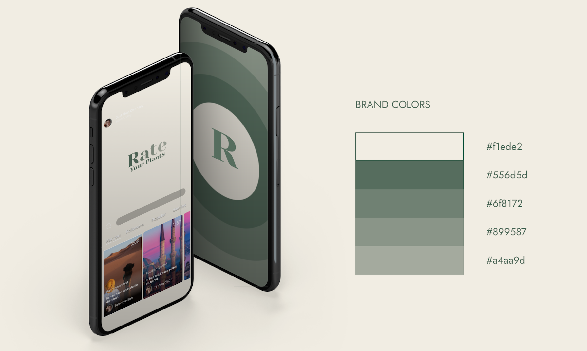
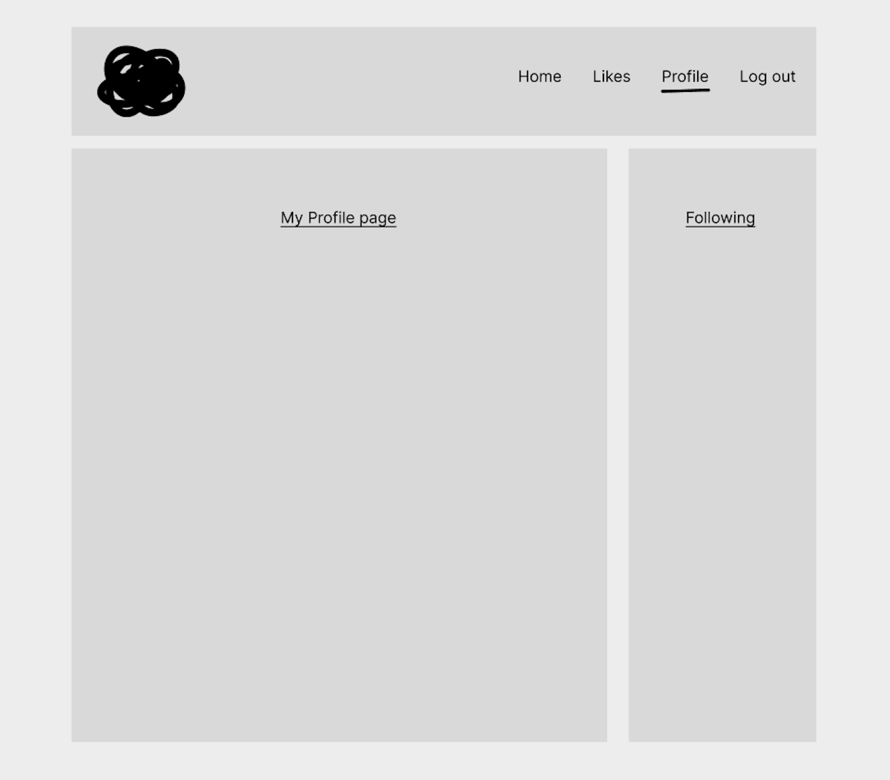
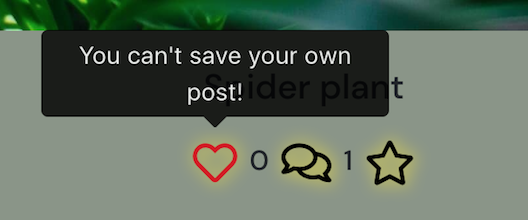

# **Rate your plants**

This is a social media platform for plant lovers! One can create an account, post pictures of their favorite plants with information about them as well as rate them in order of difficulty to care for. A signed in user can also save other users posts in order to keep a sort of “wish list” of plants.

This project is the final of 5 projects that need to be completed to receive a diploma in Fullstack Software Development from The Code Institute.

## **Responsive screen display**


A live version of this website will be found here: https://rate-your-plants.herokuapp.com/

* Deployed FrontEnd - https://rate-your-plants.herokuapp.com/

* Deployed BackEnd API - https://ryp-api.herokuapp.com/

* BackEnd Repo - https://github.com/Krnsand/ryp-api

* FrontEnd Repo - https://github.com/Krnsand/rate-your-plants/tree/main


## **Table of Contents** ##
<details><summary>UX</summary>

- [User Demographic](#user-demographic "User Demographic")
- [Site Goals](#site-goals "Site Goals")
- [Audience](#audience "Audience")
- [User Stories](#user-stories "User Stories")

</details>
<details><summary>Design</summary>

- [Colour Scheme](#color-scheme "Color Scheme")
- [Iconography](#iconography "Iconography")
- [Wireframes](#wireframes "Wireframes")
- [Images](#images "Images")

</details>
<details><summary>Features</summary>

- [NavBar](#navbar "NavBar")
- [Home Landing Page](#home-landing-page "Home Landing Page")
- [Post Page](#post-page "Post Page")
- [Feed](#feed "Feed")
- [Saved](#saved "Saved")
- [Profile Page](#profile-page "Profile Page")
- [Sign-in](#sign-in "Sign-in")
- [Sign-up](#sign-up "Sign-up")
- [No results found](#no-results-found "No results found")
- [CRUD](#crud "CRUD")
- [Defensive Design](#defensive-design "Defensive Design")
- [Future Implementations](#future-implementations "Future Implementations")
- [Components](#components "Components")

</details>

<details><summary>Technologies Used</summary>

- [Languages Used](#languages-used "Languages Used")
- [Frameworks, Libraries and Programs Used](#frameworks-libraries-and-programs-used "Frameworks, Libraries and Programs Used")
- [Databases platform and cloud storage](#databases-platform-and-cloud-storage "Databases platform and cloud storage")

</details>
<details><summary>Testing</summary>

- [Introduction](#introduction "Introduction")
- [Validator testing](#validator-testing "Validator Testing")
- [Manual Testing](#manual-testing "Manual Testing")
- [User Story Testing](#user-story-testing "User Story Testing")
- [Fixed Bugs and Solutions](#fixed-bugs-and-solutions "Fixed Bugs and Solutions") 
- [Unfixed Bugs](#unfixed-bugs "Unfixed Bugs")

</details>

<details><summary>Deployment</summary>

- [GitHub](#github "GitHub")
- [Heroku](#heroku "heroku")

</details>


<details><summary>Credits</summary>

- [Acknowledgements](#acknowledgements "Acknowledgements")
- [Sources](#sources "Sources")
- [Media](#media "Media")

</details>

------------------------------------------------------------------------------------------------------------

## **UX**

### **User Demographic**

This application has been designed for people who love plants of all kinds and who want to share content and make some new friends!
Make a profile, add a post and start interacting with fellow plant nerds! 

### **Site Goals**

The goal for this site has been to build a content sharing platform to allow users to make social media profiles, add posts, follow and unfollow other users, rate and review other users posts, as well as save them! You can also use the provided search bar to search through the posts with a keyword or a user's name. 


### **Audience**

Everyone who loves plants! Especially for those who want to learn more about them and how to best take care of them.


### **User Stories**
User Stories and Backend Tasks can be found in this GitHub repository project Kanban board, and for this project, all user stories can be found [here](https://github.com/users/Krnsand/projects/5)

## **Design**

### **Color Scheme**
The color scheme was chosen from researching trending color schemes on this website as well as matching it with an earthy logo:
[brandmark](https://app.brandmark.io/v3/).

The color palette as mentioned above.





### **Iconography**

- Most icons were taken from [Font Awesome](https://fontawesome.com/)
- Icons for “Not found” and “Upload” were taken from [flaticon](https://www.flaticon.com/)

### **Wireframes**

Wireframe for home page/feed:


<br>
<br>

Wireframe for home page/feed mobile:


<br>
<br>

Wireframe for post page:


<br>
<br>

Wireframe for post page mobile:


<br>
<br>

Wireframe for profile page:


<br>
<br>

Wireframe for profile page mobile:


<br>
<br>

### **Images**

All images for the website's pages were taken from [unsplash](https://unsplash.com/) or taken by me, and stored on Cloudinary.

The images used for the posts and profiles were sourced from unsplash. 

## **Features**

### **NavBar**
NavBar, the user is not logged in.


NavBar, the user is logged in.


### **Home Landing Page**

The home screen and landing page, with the "most followed profiles" sidebar.


### **Post Page**

- The post's page, with the "most followed profiles" sidebar.
- A heart to like/save a post, a speech bubble to comment any but one’s own post, and a star to leave a review. Each icon goes a solid color once a user has clicked on it, these icons will also undo the action if clicked on again.
- The three dots on the side of the post image is the button to edit or delete your post.
- The comment section, create, edit, and delete your comments.
- The review/rate section, create, edit, and delete your review.


### **Feed**

The Feed consists of posts from users that you follow.


### **Saved**

The Saved page consists of posts the user has specifically saved for future viewing.


### **Profile Page**

- Your profile page, or another user's, along with the sidebar of recommended profiles to follow. 
- The profile page contains a bio section, the bars in the corner to edit your profile and change your username or password.
- The page also holds all of the posts that the owner of the page has added.


### **Create Post Page**
 
- The create post page contains a section to upload an image, as well as a title and content section.


### **Sign-in**

Sign-in page, along with a link to sign up for an account if you haven't already!


### **Sign-up**

Sign-up page, along with a link to sign in if you have an account already!


### **No results found**
#### The "No results image" will appear when:

- The search bar entry does not exist
- An invalid HTTP request is made
- On the user's profile page, if no posts have been added yet:


### **CRUD**
The CRUD functionality for this project is as follows:

* The user can, once signed up to an account, update their profile with a profile picture/bio. They can also update their username and password from the profile page.
* The user can also, once a post has been created, update or delete their post. The three dots on the right of the post's image will either delete the post (and bring you back to the home page once this is done) or edit your post, bringing you to an edit post form.
* Users can also, once they've created a comment on a post, delete or edit their comments. If chosen, editing a comment will bring up a small form to retype your comment and then you can either save or close if you change your mind.
* Users can also save posts, and you can also undo all of these actions if they changed their minds.
* Users can also follow other users' accounts and unfollow them if they desire.


### **Defensive Design**

* When making a new account, the following message will appear if any of the inputs are left blank:


* Login attempts with the wrong credentials, will show the following message: 


* Login attempts leaving any input blank, will show the following message: 


* Attempts to save one's own posts will show the following message: 



* In the "Add post" section, leaving the title input blank, or not choosing an image file, will show the following message:


### **Future Implementations**
Future plans for this project include:

- Add more fields for a user to add to their profile. Such as location, age, and/or email address and other social media platforms.
- Add upvotes and downvotes count to profile stats.
- Allow users to delete their profile.
- Allow users to see who follows them, not just how many

### **Components**
* Asset.js - component for the spinner seen while the page is loading, used in PostFeed.js, PostsFeed.js, PopularProfiles.js & ProfilePage.js files.

* Avatar.js - component used for displaying the profile image. Used in NavBar.js, Post.js, Profile.js, ProfilePage.js files.

* MoreDropdown.js - component used for the functionality and display of the icons to edit/delete posts, comments, and profiles. Only shown to the owner of such posts and their profiles.

* NavBar.js - component used for the display of the NavBar, added into the main app.js file to display at the top of the page.

* NotFound.js - component used for displaying an error image and message if an invalid page has been typed in.

## **Technologies Used**
### **Languages Used**
- HTML
- CSS
- Javascript
- React


### **Frameworks, Libraries, and Programs Used**
- [Axios](https://axios-http.com/): a promised-based HTTP client for JavaScript. It has the ability to make HTTP requests from the browser and handle the transformation of request and response data.
- [Favicon](https://favicon.io/): Used to generate the favicon image from a logo generated.
- [jwt-decode](https://jwt.io/): is an open standard (RFC 7519) for securely transmitting information between parties as JSON object.
- [React-Bootstrap](https://react-bootstrap.github.io/): a component-based library that provides native Bootstrap components as pure React components.
- [react-router-dom](https://www.npmjs.com/package/react-router-dom): enables you to implement dynamic routing in a web app. 
- [react-infinite-scroll-component](https://www.npmjs.com/package/react-infinite-scroll-component): a technique that automatically adds the next page as the user scrolls down through content, more content is loaded.
- [Font Awesome](https://fontawesome.com/): a widely-used icon set that gives you scalable vector images that can be customized with CSS.
- [Google Lighthouse](https://developer.chrome.com/docs/lighthouse/overview/): an open-source tool for running technical website audits.
- [Am I Responsive?](https://ui.dev/amiresponsive): to ensure the project looked good across all devices.
- [HTML Markup Validation](https://validator.w3.org/): used to validate HTML code syntax.
- [CSS Validation Service](https://jigsaw.w3.org/css-validator/): used to validate CSS code syntax.
- [Figma](https://www.figma.com/): used to create mockups/wireframes of the project prior to starting.
- [Google Fonts](https://fonts.google.com/): a computer font and web font service owned by Google. This includes free and open source font families.
- [GitHub](https://github.com/): an Internet hosting service for software development and version control using Git.
- [Heroku](https://heroku.com/): a cloud platform as a service (PaaS) supporting several programming languages. Used to deploy and store for final deployment.

### **Databases platform and cloud storage**

- ElephantSQL Postgres: database service provided by ElephantSQL for data storage.
- Heroku Postgres: SQL database service provided directly by Heroku for storing data.
- Cloudinary: to store images and static files in production.
- Heroku: to deploy and run the application in production.


## **Testing**
### **Introduction**
This project has been continuously tested throughout the development stages using the following features:
- Python terminal for backend functionalities
- Google Developer Tools
- Manual Testing

Please see my [testing file](TESTING.md) for all manual and validator testing


## Deployment

### Local Deployment

To test the app locally, the terminal within VScode was used. The steps to run this:

* In your project workspace folder, open a terminal
* Run the command: ```npm start```
* Hit the 'open browser' button or visit ```http://localhost:3000``` in the browser.
* Use the website as usual.
 
### Production Deployment Initial

Before starting the work, the project was deployed to Heroku. This was done early in the process, to prevent having to deal with difficulties of deployment close to the project deadline. The following steps were performed for deployment:

#### Create Heroku app:

* Login in to Heroku
* Create a new app.
* Select "New" and "Create new app".
* Give the new app a name and click "Create new app".
* Select a region (Europe for this app).


#### Deploy App on Heroku:

* Under "Deployment Method" click on "GitHub" to get access to your repository.
* Enable Automatic Deploys" and/or click "Deploy Branch" to deploy your app.


## **Credits**

### **Acknowledgements**

- The Moments walkthrough was used as a guide for this project, it served as a major help in creating this site.
- My mentor at Code Institute - Martina Terlevic.
- Tutor Support at Code Institute for helping me migrate and fix my database when there had been an update.

- Extra big thank you to Code Institute for this entire course, it's been a great journey so far, and the tools and support provided during this course were amazing!


### **Sources**

- The Moments walkthrough was the main source I used as a guide for this project.
- [YouTube](https://www.youtube.com/)
- [Stack Overflow](https://stackoverflow.com/)
- [Slack](https://www.slack.com/) - for helpful tips from fellow students!
- [W3 Schools](https://www.w3schools.com/)
- [Brandmark](https://app.brandmark.io/v3/) - for the colour palette in the design section.


### **Media**

- The media sourced for this website, were mostly found on [Unsplash](https://unsplash.com/).
- Other images were from me and friends.
- The logo was generated using a logo generator from this website - [Brandmark](https://app.brandmark.io/v3/)
- The image for favicon was generated through - [favicon.io](https://favicon.io/)
- The image for the responsive design at the top of the ReadMe was generated through - 
[am i responsive?](https://ui.dev/amiresponsive)


Thank you!

[Back to top](#rate-your-plants)
