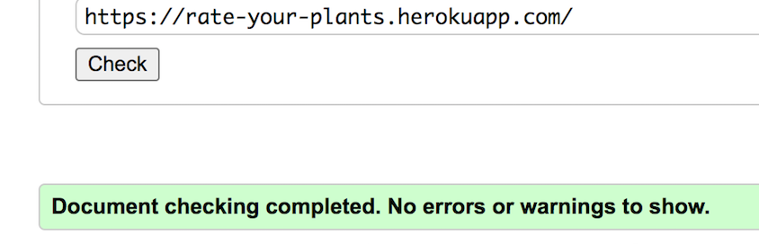
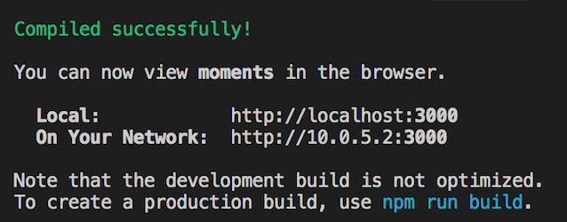

# **Rate your plants**

This is a social media platform for plant lovers! One can create an account, post pictures of their favorite plants with information about them as well as rate them in order of difficulty to care for. A signed in user can also save other users posts in order to keep a sort of “wish list” of plants.

This project is the final of 5 projects that need to be completed to receive a diploma in Fullstack Software Development from The Code Institute.

## **Responsive screen display**

A live version of this website will be found here: https://rate-your-plants.herokuapp.com/

* Deployed FrontEnd - https://rate-your-plants.herokuapp.com/

* Deployed BackEnd API - https://ryp-api.herokuapp.com/

* BackEnd Repo - https://github.com/Krnsand/ryp-api

* FrontEnd Repo - https://github.com/Krnsand/rate-your-plants/tree/main

## **Table of Contents** ##

UX

- [User Demographic](#user-demographic "User Demographic")
- [Site Goals](#site-goals "Site Goals")
- [Audience](#audience "Audience")
- [User Stories](#user-stories "User Stories")

Design

- [Colour Scheme](#color-scheme "Color Scheme")
- [Iconography](#iconography "Iconography")
- [Wireframes](#wireframes "Wireframes")
- [Images](#images "Images")

Features

- [NavBar](#navbar "NavBar")
- [Home Landing Page](#home-landing-page "Home Landing Page")
- [Post Page](#post-page "Post Page")
- [Feed](#feed "Feed")
- [Saved](#saved "Saved")
- [Profile Page](#profile-page "Profile Page")
- [Sign-in](#sign-in "Sign-in")
- [Sign-up](#sign-up "Sign-up")
- [No results found](#no-results-found "No results found")
- [CRUD](#crud "CRUD")
- [Defensive Design](#defensive-design "Defensive Design")
- [Future Implementations](#future-implementations "Future Implementations")
- [Components](#components "Components")

Technologies Used

- [Languages Used](#languages-used "Languages Used")
- [Frameworks, Libraries and Programs Used](#frameworks-libraries-and-programs-used "Frameworks, Libraries and Programs Used")
- [Databases platform and cloud storage](#databases-platform-and-cloud-storage "Databases platform and cloud storage")

Testing

- [Introduction](#introduction "Introduction")
- [Validator testing](#validator-testing "Validator Testing")
- [Manual Testing](#manual-testing "Manual Testing")
- [User Story Testing](#user-story-testing "User Story Testing")
- [Fixed Bugs and Solutions](#fixed-bugs-and-solutions "Fixed Bugs and Solutions") 
- [Unfixed Bugs](#unfixed-bugs "Unfixed Bugs")

Deployment

- [GitHub](#github "GitHub")
- [Heroku](#heroku "heroku")

Credits

- [Acknowledgements](#acknowledgements "Acknowledgements")
- [Sources](#sources "Sources")
- [Media](#media "Media")

------------------------------------------------------------------------------------------------------------

## **UX**

### **User Demographic**

This application has been designed for people who love plants of all kinds and who want to share content and make some new friends!
Make a profile, add a post and start interacting with fellow plant nerds! 

### **Site Goals**

The goal for this site has been to build a content sharing platform to allow users to make social media profiles, add posts, follow and unfollow other users, rate and review other users posts, as well as save them! You can also use the provided search bar to search through the posts with a keyword or a user's name. 

### **Audience**

Everyone who loves plants! Especially for those who want to learn more about them and how to best take care of them.

### **User Stories**
User Stories and Backend Tasks can be found in this GitHub repository project Kanban board, and for this project, all user stories can be found [here](https://github.com/users/Krnsand/projects/5)

## **Design**

### **Color Scheme**
The color scheme was chosen from researching trending color schemes on this website as well as matching it with an earthy logo:
[brandmark](https://app.brandmark.io/v3/).

The color palette as mentioned above.

### **Iconography**

- Most icons were taken from [Font Awesome](https://fontawesome.com/)
- Icons for “Not found” and “Upload” were taken from [flaticon](https://www.flaticon.com/)

### **Wireframes**

Wireframe for home page/feed:

 
 

Wireframe for home page/feed mobile:

 
 

Wireframe for post page:

 
 

Wireframe for post page mobile:

 
 

Wireframe for profile page:

 
 

Wireframe for profile page mobile:

 
 

### **Images**

All images for the website's pages were taken from [unsplash](https://unsplash.com/) or taken by me, and stored on Cloudinary.

The images used for the posts and profiles were sourced from unsplash. 

## **Features**

### **NavBar**
NavBar, the user is not logged in.

NavBar, the user is logged in.

### **Home Landing Page**

The home screen and landing page, with the "most followed profiles" sidebar.

### **Post Page**

- The post's page, with the "most followed profiles" sidebar.
- A heart to like/save a post, a speech bubble to comment any but one’s own post, and a star to leave a review. Each icon goes a solid color once a user has clicked on it, these icons will also undo the action if clicked on again.
- The three dots on the side of the post image is the button to edit or delete your post.
- The comment section, create, edit, and delete your comments.
- The review/rate section, create, edit, and delete your review.

### **Feed**

The Feed consists of posts from users that you follow.

### **Saved**

The Saved page consists of posts the user has specifically saved for future viewing.

### **Profile Page**

- Your profile page, or another user's, along with the sidebar of recommended profiles to follow. 
- The profile page contains a bio section, the bars in the corner to edit your profile and change your username or password.
- The page also holds all of the posts that the owner of the page has added.

### **Create Post Page**
 
- The create post page contains a section to upload an image, as well as a title and content section.

### **Sign-in**

Sign-in page, along with a link to sign up for an account if you haven't already!

### **Sign-up**

Sign-up page, along with a link to sign in if you have an account already!

### **No results found**
#### The "No results image" will appear when:

- The search bar entry does not exist
- An invalid HTTP request is made
- On the user's profile page, if no posts have been added yet:

### **CRUD**
The CRUD functionality for this project is as follows:

* The user can, once signed up to an account, update their profile with a profile picture/bio. They can also update their username and password from the profile page.
* The user can also, once a post has been created, update or delete their post. The three dots on the right of the post's image will either delete the post (and bring you back to the home page once this is done) or edit your post, bringing you to an edit post form.
* Users can also, once they've created a comment on a post, delete or edit their comments. If chosen, editing a comment will bring up a small form to retype your comment and then you can either save or close if you change your mind.
* Users can also save posts, and you can also undo all of these actions if they changed their minds.
* Users can also follow other users' accounts and unfollow them if they desire.

### **Defensive Design**

* When making a new account, the following message will appear if any of the inputs are left blank:

* Login attempts with the wrong credentials, will show the following message: 

* Login attempts leaving any input blank, will show the following message: 

* Attempts to save one's own posts will show the following message: 

* If you choose to edit or delete your post, clicking the three dots on the right side of the post's image on the post page, will show the following pop-up messages once you hover over each icon, to ensure you know what you're doing before you click:

 

* In the "Add post" section, leaving the title input blank, or not choosing an image file, will show the following message:

### **Future Implementations**
Future plans for this project include:

- Add more fields for a user to add to their profile. Such as location, age, and/or email address and other social media platforms.
- Add upvotes and downvotes count to profile stats.
- Allow users to delete their profile.

### **Components**
* Asset.js - component for the spinner seen while the page is loading, used in PostFeed.js, PostsFeed.js, PopularProfiles.js & ProfilePage.js files.

* Avatar.js - component used for displaying the profile image. Used in NavBar.js, Post.js, Profile.js, ProfilePage.js files.

* MoreDropdown.js - component used for the functionality and display of the icons to edit/delete posts, comments, and profiles. Only shown to the owner of such posts and their profiles.

* NavBar.js - component used for the display of the NavBar, added into the main app.js file to display at the top of the page.

* NotFound.js - component used for displaying an error image and message if an invalid page has been typed in.

## **Technologies Used**
### **Languages Used**
- HTML
- CSS
- Javascript
- React

### **Frameworks, Libraries, and Programs Used**
- [Axios](https://axios-http.com/): a promised-based HTTP client for JavaScript. It has the ability to make HTTP requests from the browser and handle the transformation of request and response data.
- [Favicon](https://favicon.io/): Used to generate the favicon image from a logo generated.
- [jwt-decode](https://jwt.io/): is an open standard (RFC 7519) for securely transmitting information between parties as JSON object.
- [React-Bootstrap](https://react-bootstrap.github.io/): a component-based library that provides native Bootstrap components as pure React components.
- [react-router-dom](https://www.npmjs.com/package/react-router-dom): enables you to implement dynamic routing in a web app. 
- [react-infinite-scroll-component](https://www.npmjs.com/package/react-infinite-scroll-component): a technique that automatically adds the next page as the user scrolls down through content, more content is loaded.
- [Font Awesome](https://fontawesome.com/): a widely-used icon set that gives you scalable vector images that can be customized with CSS.
- [Google Lighthouse](https://developer.chrome.com/docs/lighthouse/overview/): an open-source tool for running technical website audits.
- [Am I Responsive?](https://ui.dev/amiresponsive): to ensure the project looked good across all devices.
- [HTML Markup Validation](https://validator.w3.org/): used to validate HTML code syntax.
- [CSS Validation Service](https://jigsaw.w3.org/css-validator/): used to validate CSS code syntax.
- [Figma](https://www.figma.com/): used to create mockups/wireframes of the project prior to starting.
- [Google Fonts](https://fonts.google.com/): a computer font and web font service owned by Google. This includes free and open source font families.
- [GitHub](https://github.com/): an Internet hosting service for software development and version control using Git.
- [Heroku](https://heroku.com/): a cloud platform as a service (PaaS) supporting several programming languages. Used to deploy and store for final deployment.

### **Databases platform and cloud storage**

- ElephantSQL Postgres: database service provided by ElephantSQL for data storage.
- Heroku Postgres: SQL database service provided directly by Heroku for storing data.
- Cloudinary: to store images and static files in production.
- Heroku: to deploy and run the application in production.

## **Testing**
### **Introduction**
This project has been continuously tested throughout the development stages using the following features:
- Python terminal for backend functionalities
- Google Developer Tools
- Manual Testing

### **Validator Testing**
- All HTML files passed through the HTML checker with no errors.

- CSS files pass through the Jigsaw validator without error.

- All JSX code was validated and corrected throughout the development of the project.

#### **LightHouse testing**

All results for performance are extremely bad even after drastically compressing all the images.

* **For Desktop:**

    | Section | Performance | Accessibility | Best Practices | SEO |
    | --- | --- | --- | --- | --- |
    | Home | 42 | 97 | 92 | 91 |
    | Post Page | 45 | 97 | 92 | 100 |
    | Feed | 29 | 97 | 92 | 100 |
    | Saved | 30 | 97 | 92 | 100 |
    | Sign Up | 89 | 88 | 83 | 91 |
    | Sign in | 92 | 88 | 83 | 91 |
    | Profile | 48 | 86 | 92 | 91 |

* **For Mobile devices:**

    | Section | Performance | Accessibility | Best Practices | SEO |
    | --- | --- | --- | --- | --- |
    | Home | 50 | 97 | 92 | 100 |
    | Post Page | 22 | 97 | 92 | 100 |
    | Feed | 41 | 97 | 92 | 100 |
    | Saved | 27 | 97 | 92 | 100 |
    | Sign Up | 90 | 97 | 83 | 100 |
    | Sign in | 91 | 97 | 83 | 100 |
    | Profile | 39 | 87 | 92 | 92 |

### **Manual Testing**
Manual testing for this project was carried out as follows: 
- Users can see sign-in and sign-up only when not logged in.
- Users can create a new account.
- Users can then, sign in to their account and then be redirected to the home page.
- Users can log out.
- Once signed in, users can create, save, comment and review/rate posts. They can edit and delete their posts, comments and reviews. 
- Users can edit and update their profiles, which include a profile picture, bio entry, and a separate username and password edit feature.
- All NavLinks and buttons go to their destination.
- Clicking on the post image brings you to the post's page.
- You can save and undo these actions if you change your mind.
- Once you hover over the save/comment icons, they let you know if you need to sign-in to use this feature, and once clicked on if the user is signed out, you will be redirected to the sign-in page.
- The user is notified of what each icon represents. In each post page, if the user is the owner, the three dots to the right side of the post image will bring up the edit and delete feature, both icons have an overlay trigger to indicate which one does what feature.
- The site was continuously built on google chrome, and once built, it was successfully tested on firefox browser, and edge browser. No issues with either browser.

### **User story testing**
**User story:**

1: User: Navigation - *”As a user I can easily navigate the site to find what I need”* ✅

2: User: Understand site - *”As a user I can understand quickly what the site is about in order to know if it is for me”* ✅

3: User: Return home - *”As a signed in user, I can click on the logo on any page so that I can easily get back to the home page”* ✅

4: User: Admin access - *”As an administrator I can limit access to other peoples accounts to keep their profiles safe”* ✅

5: User: Admin add users - *”As an administrator I can add new profiles to widen the community”* ✅

6: User: Admin remove users - *”As an administrator I can remove users in case of inappropriate behavior or other reasons”* ✅

7: User: Authentication - Create account - *"As a user I can create a new account so that I can access all the features for signed up users."*
✅

8: User: Authentication - Sign in - *"As a user I can sign in to the app so that I can access functionality and features for logged in users."* ✅

9: User: Authentication - Logged in Status - *"As a user I can always tell if I am logged in or not so that I can log in to use features."* ✅

10: User: Authentication - Refreshing access tokens - *"As a user I can maintain my logged-in status (for 24hrs) until I choose to log out so that my user experience is not compromised."* ✅

11: User: Navigation: Conditional rendering - *"As a logged out user I can see sign in/sign up options so that I can sign in/sign up."* ✅

12: User: Others profiles - *"As a signed in user I can view other users profiles to see only their posts and bio and read more about them."* ✅

13: User: Create posts - *"As a logged in user I can create posts so that I can share my images and image content with my followers."* ✅

14: User: Specific post - *"As a user I can view a specific post to get more info about it."* ✅

15: User: Save and comment - *"As a signed in user I can save and comment other peoples posts to engage with other users."* ✅

16: User: Rate posts - *”As a signed in user I can rate things in other peoples posts to engage in the community.”* ✅

17: User: Searchbar filter - *"As a user, I can search for posts with keywords, so that I can find the posts and user profiles that I prefer to see."* ✅

18: User: View liked/saved posts - *"As a logged in user I can view the posts I liked/saved so that I can find the posts that I love."* ✅

19: User: Infinite scroll - *"As a user I can keep scrolling through the images on the site, which are loaded automatically so that there is no need for a "next page/previous page" option."* ✅

20: User: Edit posts/comments - *"As a signed in user, I can edit my posts and comments so that I can change them if I want to."* ✅

21: User: Delete posts/comments - *"As a signed in user, I can delete my posts and comments so that I can have control over what I show."* ✅

22: User: Most popular profiles - *"As a user I can see a list of the most followed profiles so that I can see which profiles are popular and see their posts."* ✅

23: User: Follow/Unfollow a user - *"As a logged in user I can follow and unfollow users so that I can see and remove posts by specific users in my posts feed."* ✅

24: User: Edit profile - *"As a logged in user I can edit my profile so that I can change my profile picture, name and bio to keep my followers updated."* ✅

25: User: Delete profile - *"As a logged in user I can delete my profile in case I decide to leave this social media."* - Future implementation.

26: User: Update username and password - *"As a logged in user I can update my username and password so that I can change my display name and keep my profile more secure."* ✅

27: User: Unlike/unsave a post - *"As a user I can unlike/unsave a post so that I can change what I see in my liked/saved feed."* ✅

The link To GitHub KanBan Project - [here](https://github.com/users/Krnsand/projects/5)

### **Fixed bugs and solutions**

- The speech bubble icon did not change color while being hovered over.
    * Solution: .

### **Unfixed bugs**
- No unfixed bugs to report during the production of this project.

- One thing to note is when doing the lighthouse report, best practices for the sign-in and sign-up page show a result of 75, the image shows up tagged as low resolution.
- There are errors in the console of these pages, that were also brought up during the walkthrough Moments. The errors are as follows:

*Failed to load resource: the server responded with a status of 401 (Unauthorized)*

## **Deployment**

### **GitHub**
The following bullet points detail the steps gone through to set up this project on GitHub:
- Create a Repository on GitHub (Not using any Code Institue Template).
- Create a new workspace. Once the workspace has started, run the following command in the terminal window:

    *npx create-react-app . --template git+https://github.com/Code-Institute-Org/cra-template-moments.git --use-npm*

- Enter "y" to confirm installing the create-react-app package.
- Once the packages have been installed, run *npm start* to check that react is working correctly.
- Once you can see it's running efficiently, go into the App.js file and remove the React Custom header and replace it with a test text "Hello, world!", and remove the logo import at the top of the page.
- In the preview window, you should see the test text show up now.
- Once you see this test text, add, commit, and push your changes.

### **Heroku**
The following bullet points detail the steps gone through to set up this project on Heroku:
- In Heroku: Click on the "new" button and follow the steps to create a new app, noting that a unique name is required.
- Once your unique name is chosen and you've selected your appropriate region, click "Create app".
- Once this app is created, in the "deploy" tab in Heroku, you can connect this to your GitHub repository.
- From the "Deployment method" section, choose GitHub, enter the name of the repo just created and use the search feature to find it, and then click "connect".
- When you've successfully connected your repo. Go to the 'Manual Deploy' section and click 'Deploy Branch'. Click on 'build logs' to monitor the build and ensure deployment is successful. The build is completed when the log says 'Build succeeded!'.
- Next step is to install Bootstrap 4, by typing the following command in the terminal window:

    *npm install react-bootstrap@1.6.3 bootstrap@4.6.0*

## **Credits**

### **Acknowledgements**

- The Moments walkthrough was used as a guide for this project, it served as a major help in creating this site.
- My mentor at Code Institute - Martina Terlevic.
- Tutor Support at Code Institute for helping me migrate and fix my database when there had been an update.

- Extra big thank you to Code Institute for this entire course, it's been a great journey so far, and the tools and support provided during this course were amazing!

### **Sources**

- The Moments walkthrough was the main source I used as a guide for this project.
- [YouTube](https://www.youtube.com/)
- [Stack Overflow](https://stackoverflow.com/)
- [Slack](https://www.slack.com/) - for helpful tips from fellow students!
- [W3 Schools](https://www.w3schools.com/)
- [Brandmark](https://app.brandmark.io/v3/) - for the colour palette in the design section.

### **Media**

- The media sourced for this website, were mostly found on [Unsplash](https://unsplash.com/).
- Other images were from me and friends.
- The logo was generated using a logo generator from this website - [Brandmark](https://app.brandmark.io/v3/)
- The image for favicon was generated through - [favicon.io](https://favicon.io/)
- The image for the responsive design at the top of the ReadMe was generated through - 
[am i responsive?](https://ui.dev/amiresponsive)

Thank you!

[Back to top](#Rate your plants)
