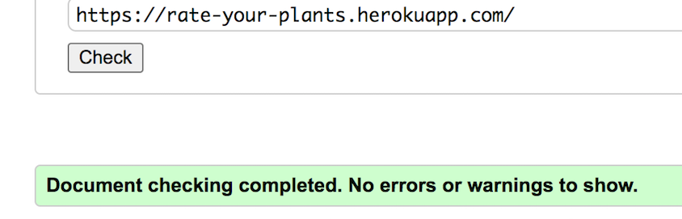
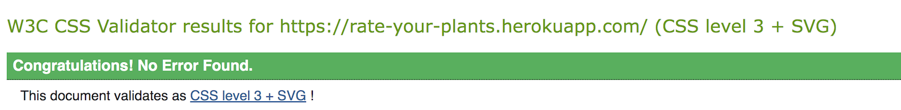
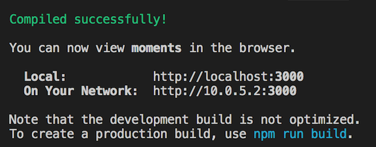

## **Testing**
### **Introduction**
This project has been continuously tested throughout the development stages using the following features:
- Python terminal for backend functionalities
- Google Developer Tools
- Manual Testing

### **Validator Testing**
- All HTML files passed through the HTML checker with no errors.

- CSS files pass through the Jigsaw validator without error.

- All JSX code was validated and corrected throughout the development of the project.

#### **LightHouse testing**

- All results for **performance** are extremely bad even after drastically compressing all the images.

* **For Desktop:**

    | Section | Performance | Accessibility | Best Practices | SEO |
    | --- | --- | --- | --- | --- |
    | Home | 42 | 97 | 92 | 91 |
    | Post Page | 45 | 97 | 92 | 100 |
    | Feed | 29 | 97 | 92 | 100 |
    | Saved | 30 | 97 | 92 | 100 |
    | Sign Up | 89 | 88 | 83 | 91 |
    | Sign in | 92 | 88 | 83 | 91 |
    | Profile | 48 | 86 | 92 | 91 |

* **For Mobile devices:**

    | Section | Performance | Accessibility | Best Practices | SEO |
    | --- | --- | --- | --- | --- |
    | Home | 50 | 97 | 92 | 100 |
    | Post Page | 22 | 97 | 92 | 100 |
    | Feed | 41 | 97 | 92 | 100 |
    | Saved | 27 | 97 | 92 | 100 |
    | Sign Up | 90 | 97 | 83 | 100 |
    | Sign in | 91 | 97 | 83 | 100 |
    | Profile | 39 | 87 | 92 | 92 |

### **Manual Testing**
Manual testing for this project was carried out as follows: 
- Users can see sign-in and sign-up only when not logged in.
- Users can create a new account.
- Users can then, sign in to their account and then be redirected to the home page.
- Users can log out.
- Once signed in, users can create, save, comment and review/rate posts. They can edit and delete their posts, comments and reviews. 
- Users can edit and update their profiles, which include a profile picture, bio entry, and a separate username and password edit feature.
- All NavLinks and buttons go to their destination.
- Clicking on the post image brings you to the post's page.
- You can save and undo these actions if you change your mind.
- Once you hover over the save/comment icons, they let you know if you need to sign-in to use this feature, and once clicked on if the user is signed out, you will be redirected to the sign-in page.
- The user is notified of what each icon represents. In each post page, if the user is the owner, the three dots to the right side of the post image will bring up the edit and delete feature, both icons have an overlay trigger to indicate which one does what feature.
- The site was continuously built on google chrome, and once built, it was successfully tested on firefox browser, and edge browser. No issues with either browser.

### **User story testing**
**User story:**

1: User: Navigation - *”As a user I can easily navigate the site to find what I need”* ✅

2: User: Understand site - *”As a user I can understand quickly what the site is about in order to know if it is for me”* ✅

3: User: Return home - *”As a signed in user, I can click on the logo on any page so that I can easily get back to the home page”* ✅

4: User: Admin access - *”As an administrator I can limit access to other peoples accounts to keep their profiles safe”* ✅

5: User: Admin add users - *”As an administrator I can add new profiles to widen the community”* ✅

6: User: Admin remove users - *”As an administrator I can remove users in case of inappropriate behavior or other reasons”* ✅

7: User: Authentication - Create account - *"As a user I can create a new account so that I can access all the features 
for signed up users."* ✅

8: User: Authentication - Sign in - *"As a user I can sign in to the app so that I can access functionality and features for logged in users."* ✅

9: User: Authentication - Logged in Status - *"As a user I can always tell if I am logged in or not so that I can log in to use features."* ✅

10: User: Authentication - Refreshing access tokens - *"As a user I can maintain my logged-in status (for 24hrs) until I choose to log out so that my user experience is not compromised."* ✅

11: User: Navigation: Conditional rendering - *"As a logged out user I can see sign in/sign up options so that I 
can sign in/sign up."* ✅

12: User: Others profiles - *"As a signed in user I can view other users profiles to see only their posts and bio and read more 
about them."* ✅

13: User: Create posts - *"As a logged in user I can create posts so that I can share my images and image content 
with my followers."* ✅

14: User: Specific post - *"As a user I can view a specific post to get more info about it."* ✅

15: User: Save and comment - *"As a signed in user I can save and comment other peoples posts to engage with other users."* ✅

16: User: Rate posts - *”As a signed in user I can rate things in other peoples posts to engage in the community.”* ✅

17: User: Searchbar filter - *"As a user, I can search for posts with keywords, so that I can find the posts and user profiles that I prefer to see."* ✅

18: User: View liked/saved posts - *"As a logged in user I can view the posts I liked/saved so that I can find the posts 
that I love."* ✅

19: User: Infinite scroll - *"As a user I can keep scrolling through the images on the site, which are loaded automatically so that there is no need for a "next page/previous page" option."* ✅

20: User: Edit posts/comments - *"As a signed in user, I can edit my posts and comments so that I can change them if I 
want to."* ✅

21: User: Delete posts/comments - *"As a signed in user, I can delete my posts and comments so that I can have control over what I show."* ✅

22: User: Most popular profiles - *"As a user I can see a list of the most followed profiles so that I can see which profiles are popular and see their posts."* ✅

23: User: Follow/Unfollow a user - *"As a logged in user I can follow and unfollow users so that I can see and remove posts by specific users in my posts feed."* ✅

24: User: Edit profile - *"As a logged in user I can edit my profile so that I can change my profile picture, name and bio to keep my followers updated."* ✅

25: User: Delete profile - *"As a logged in user I can delete my profile in case I decide to leave this social media."* - Future implementation.

26: User: Update username and password - *"As a logged in user I can update my username and password so that I can change my display name and keep my profile more secure."* ✅

27: User: Unlike/unsave a post - *"As a user I can unlike/unsave a post so that I can change what I see in my liked/saved feed."* ✅

The link To GitHub KanBan Project - [here](https://github.com/users/Krnsand/projects/5)

### **Fixed bugs and solutions**

- The reviews disappeared when the pages were refreshed.
    * Solution: I had missed to connect the reviews to the api, after adding another axiosReq.get it worked great.

### **Unfixed bugs**
- Writing a very long id in the url (for example: .../profiles/123jkhkjh4e3/) does not raise an error, it just loads forever. This is something I will look into in the future.

- The review count does not want to work, as time has run away from me I will not fix this bug right now

- There are errors in the console of these pages, that were also brought up during the walkthrough Moments. The errors are as follows:

*Failed to load resource: the server responded with a status of 401 (Unauthorized)*